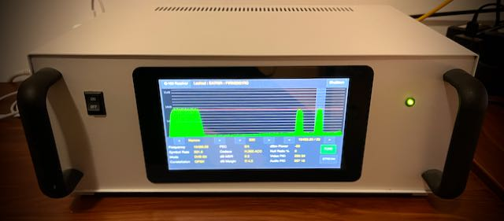

# Q-100 Receiver
### Control and monitor a DATV receiver with a touch screen.

### REQUIRES Raspberry PI OS (Legacy 64-BIT) - the Bookworm Desktop version

The project was first commited to GitHub 2 years ago, but I screwed my git commands. This repro re-started late November, 2025.

## Hardware
- Raspberry Pi 4B with 4GB RAM (minimum)
- Raspberry Pi Official 7" Touch Screen
- BATC MiniTiouner v2.0

## Connections
- Wired internet connection (not wifi)
- Mount Pi 4B to the Touch Screen, including GPIO power wires
- Connect 5v to MiniTiouner
- Connect 5v to RPi
- Connect MiniTiouner USB to RPi bottom right USB3 (next to RJ45)
- Connect RPi RJ45 to local network

## Installing
**A keyboard and mouse are not required at any time**

### Using Raspberry Pi Imager v2.0.0 (or later)
```
CHOOSE Raspberry Pi Device: Raspberry Pi 4 

CHOOSE Raspberry Pi OS (other)

CHOOSE Operating Sysytem: Raspberry Pi OS (Legacy 64-bit)

Note: this is the Debian Bookwork version with a desktop environment

Unforunatley, the new Trixie version, with labwc, is a load of crap

Set hostname to: rxtouch
Set city, timezone, kbd layout to: <whatever>
Set Username to: pi
Set Password to <whatever>
Do not set any Wifi
Enable SSH
Set Authenticationmechanism to: Use password autentication
Then Write the image and wait forever...
```

Insert the card into the Raspberry Pi and switch on

NOTE: the Pi will reboot during the install, so please allow it to complete

### Remote login from a Mac, PC or Linux host
```
ssh pi@rxtouch.local
```
### From now on we're on the Pi
```
sudo apt update
sudo apt -y install git
mkdir /home/pi/Q100
cd /home/pi/Q100
git clone https://github.com/ea7kir/q100receiver.git
chmod +x /home/pi/Q100/q100receiver/etc/install.sh
/home/pi/Q100/q100receiver/etc/install.sh
```
### After rebooting
Use your finger to configure some Desktop settings:
```
Appearance Settings / Taskbar
    Set Taskbar to DSI-1
Appearance Settings / Desktop:
    Set HDMI wallpaper to NoVideo.jpg
    Disable Documents, Wastebasket and External Disks for HDMI and DSI-1
Adjust Volume level to maximum
Right click Volume and direct audio to HDMI and disable audio jack
TurnOff Bluetooth
If updates are available, install them now
```
Login from a PC, Mac, or Linux computer
```
ssh pi@rxtouch.local or open VSCODE to RxTouch  ~/Q100/q100receiver/q100reciever
```
Execute the following commands
```
cd Q100/q100receiver
go mod tidy
go build --tags nox11 .
```
Execute q100receiver from the current directory
```
./q100receiver
```
If all went well it can be executed at boot by enabling systemctl
```
sudo systemctl enable q100receiver
sudo systemctl start q100receiver
```
Note: add or omit the ```-shutdown``` flag in the service file to allow a full shutdown as required

## License
Copyright (c) 2023 Michael Naylor EA7KIR

This program is free software: you can redistribute it and/or modify it under the terms of the GNU General Public License as published by the Free Software Foundation, either version 3 of the License, or (at your option) any later version.

This program is distributed in the hope that it will be useful, but WITHOUT ANY WARRANTY; without even the implied warranty of MERCHANTABILITY or FITNESS FOR A PARTICULAR PURPOSE. See the GNU General Public License for more details.

You should have received a copy of the GNU General Public License along with this program. If not, see https://www.gnu.org/licenses/.


[def]: doc/rx.jpeg
